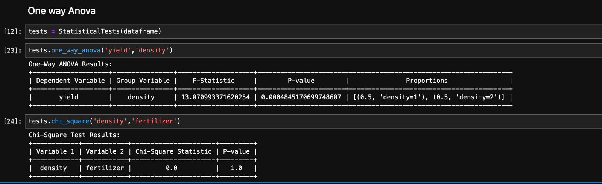

I've developed a straightforward library aimed at simplifying statistical tests. With this library, users can effortlessly compute ANOVA and Chi-square tests without the need to handle complex computations themselves. If you've ever used software like Stata, you're likely familiar with how easily you can obtain outputs for tests such as ANOVA. However, when working with Python, performing tasks like ANOVA can be time-consuming. For instance, you may need to manually create groups, split data, and then apply statistical functions like `one_way` from the `scipy` library. This process can be tedious and frustrating, especially when Python offers such streamlined data analysis capabilities for most tasks. 

In my experience, dealing with these specific tests in Python has been particularly cumbersome. While exploring options to simplify this process, I experimented with tools like `pystata`, which aim to bridge the gap between Stata and Python environments. However, I found these solutions to be cumbersome as they essentially provide a separate environment without integrating the functionality seamlessly into Python code. 

This led me to develop my own solution—a library that streamlines these statistical tests while remaining easy to use. I've decided to share this library with others in the hope that it might prove helpful in simplifying statistical analysis tasks for fellow Python users. Using this library is straightforward, making it accessible to users of all skill levels.

## How to use 

You will have to install the library first from pypi using 
```
pip install staty-tests==0.1.0
```

```py
    from statistical_tests.tests import StatisticalTests
    import pandas as pd

    # Create an instance of StatisticalTests with your dataframe
    dataframe = pd.read_csv('your_data.csv')
    tests = StatisticalTests(dataframe)

    # Perform one-way ANOVA
    tests.one_way_anova('dependent_variable', 'group_variable1', 'group_variable2')

    # Perform chi-square test
    tests.chi_square('variable1', 'variable2')
```
### Output
The output of staty-tests is like this:
{ align=center }
### Comparisons to stata

- `tests.one_way_anova('dependent_variable', 'group_variable1')` is similar to `oneway 'dependent_variable','group_variable1'` but you can add as many variables as you want. These will all be organized in a clean table.

- `tests.chi_square('variable1', 'variable2')` is similar to `tab variable1 variable2, chi2` in stata

### Hook me up
I havent done much tests so you can hook me up via [email](mailto:morristwino2@gmail.com) for any feedback. Text me with other libraries that do this, I would like to know.

Hope this simplifies your analysis in python as you can concentrate on the main logic than wasting time. If your data is already split, this library won't be of much help unless you will form one dataframe. This is because all the motivation is comming from stata.

Then for the group variables, if variable has more than two groups, the table is visible but not tidy, maybe will try to see how to improve the visaul.

### Bye Bye

